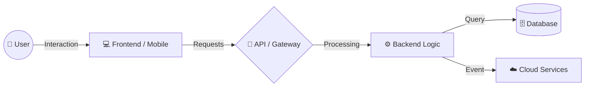

# 💻 Full-Stack Development Master Roadmap

> **The definitive guide to becoming a world-class Full-Stack Architect.**  
> *From the first pixel of the UI to the last node in the Kubernetes cluster.*

---

## 📖 Table of Contents
1.  [🚀 What is Full-Stack Development](#-what-is-full-stack-development)
2.  [🔄 Application Lifecycle](#-application-lifecycle)
3.  [⚔️ Common Tech Stacks](#-common-tech-stacks)
4.  [🎭 Types of Full-Stack Developers](#-types-of-full-stack-developers)
5.  [🏗 The 13 Layers of Full-Stack Architecture](#-the-13-layers-of-full-stack-architecture)
    *   [Frontend](#1-frontend) | [Backend](#2-backend) | [API](#3-api) | [Database](#4-database)
    *   [Servers](#5-servers--os) | [Networking](#6-networking-basics) | [Cloud](#7-cloud-infrastructure) | [CI/CD](#8-cicd-pipelines)
    *   [Security](#9-cyber-security) | [Containers](#10-containers--orchestration) | [CDN](#11-cdn--caching) | [Monitoring](#12-monitoring--logging)
    *   [Backup](#13-backups--recovery)
6.  [🛠 Professional Toolkit](#-professional-toolkit)
7.  [🧠 Mastery Checklist](#-mastery-checklist)
8.  [⚠️ The Reality Check](#-the-reality-check)

---

## 🚀 What is Full-Stack Development

Full-Stack development is the art of building both the **Frontend** (client-side) and **Backend** (server-side) of a web application. A true Full-Stack Engineer is a **Generalist** who understands how every piece of the puzzle fits together to ship a production-ready product.

### 🌐 The Ecosystem at a Glance
*   **Frontend**: UI/UX, responsiveness, and user interaction.
*   **Backend**: Business logic, authentication, and server-side processing.
*   **API**: The bridge connecting the client and the server.
*   **Database**: Persistent storage for all application data.
*   **DevOps**: Infrastructure, automation, and deployment pipelines.

### 🔄 High-Level Architecture

---

## 🔄 Application Lifecycle

Modern software isn't just "written"—it is **managed** through a continuous cycle.

| Phase | Description | Key Focus |
| :--- | :--- | :--- |
| **Development** | Writing code, local testing, and design. | DX (Dev Experience) |
| **Testing** | Automated Unit, Integration, and E2E checks. | Quality Assurance |
| **Deployment** | Pushing code to Staging and Production. | Automation / Uptime |
| **Monitoring** | Tracking errors, health, and user metrics. | Observability |
| **Maintenance** | Bug fixes, patches, and feature updates. | Sustainability |

---

## ⚔️ Common Tech Stacks

| Stack | Core Components | Best For... |
| :--- | :--- | :--- |
| **MERN** | MongoDB, Express, React, Node.js | Fast, modern JS-only apps |
| **T3** | Next.js, Tailwind, Prisma, tRPC | Type-safe React performance |
| **MEAN** | MongoDB, Express, Angular, Node.js | Robust enterprise applications |
| **LAMP** | Linux, Apache, MySQL, PHP | Classic, SEO-friendly CMS |
| **Django** | Python, Django, PostgreSQL, Vue/React | Data science & rapid prototyping |
| **.NET** | Azure, C#, SQL Server, Angular | Large-scale corporate ecosystems |

---

## 🏗 The 13 Layers of Full-Stack Architecture

### 1. Frontend
*   **Definition**: The user-facing interface.
*   **Technologies**: `React`, `TypeScript`, `Next.js`, `Tailwind CSS`.
*   **Mastery Key**: Building a complex dashboard that is fully responsive, accessible (A11y), and fast.

> [!TIP]
> **Checklist:**
> - [ ] Master Flexbox & CSS Grid
> - [ ] Use `clamp()` for fluid typography
> - [ ] Implement global state (Zustand/Redux)
> - [ ] Optimize Core Web Vitals (LCP, FID, CLS)

---

### 2. Backend
*   **Definition**: The "Brain" of the application.
*   **Technologies**: `Node.js`, `FastAPI`, `Go`, `Prisma`.
*   **Mastery Key**: Designing a secure, modular server that handles thousands of concurrent requests.

> [!TIP]
> **Checklist:**
> - [ ] Implement JWT/OAuth authentication
> - [ ] Build middleware for error handling
> - [ ] Use worker threads for heavy tasks
> - [ ] Design scalable microservices

---

### 3. API Design
*   **Definition**: System communication protocols.
*   **Technologies**: `REST`, `GraphQL`, `gRPC`, `tRPC`.
*   **Mastery Key**: Creating self-documenting APIs that are versioned and rate-limited.

> [!TIP]
> **Checklist:**
> - [ ] Follow RESTful naming conventions
> - [ ] Write Swagger/OpenAPI docs
> - [ ] Implement real-time WebSockets
> - [ ] Handle validation (Zod/Joi)

---

### 4. Database Management
*   **Definition**: Persistent data storage.
*   **Technologies**: `PostgreSQL`, `MongoDB`, `Redis`, `Supabase`.
*   **Mastery Key**: Modeling complex relationships and optimizing queries with proper indexing.

---

### 5. Servers & OS
*   **Technologies**: `Linux`, `Ubuntu`, `Nginx`, `Bash`.
*   **Checklist**:
    * [ ] Efficient use of terminal (Vim, Zsh)
    * [ ] Configured Nginx as a reverse proxy
    * [ ] Managed processes with `PM2`

---

### 6. Networking Basics
*   **Concepts**: `HTTP/3`, `DNS`, `SSL/TLS`, `CORS`, `IP Subnets`.
*   **Logic**: Understanding how a request travels from a user's browser to your server.

---

### 7. Cloud Infrastructure
*   **Providers**: `AWS`, `Google Cloud`, `Azure`, `Vercel`.
*   **Checklist**:
    * [ ] S3 bucket for file storage
    * [ ] Lambda/Serverless functions
    * [ ] Managed RDS/Postgres setup

---

### 8. CI/CD Pipelines
*   **Tools**: `GitHub Actions`, `Jenkins`, `GitLab CI`.
*   **Goal**: Zero-touch delivery. Every merge to `main` is automatically tested and deployed.

---

### 9. Cyber Security
*   **Focus**: `OWASP Top 10`, `Encryption`, `Hashing`, `CORS`.
*   **Checkpoint**: Is your app safe from SQL Injection and Cross-Site Scripting (XSS)?

---

### 10. Containers & Orchestration
*   **Tools**: `Docker`, `Kubernetes`, `Docker Compose`.
*   **Goal**: "It works on my machine" is dead. Consistently packaged environments.

---

### 11. CDN & Caching
*   **Tools**: `Cloudflare`, `CloudFront`, `Varnish`.
*   **Goal**: Global performance. Serving assets from the nearest edge location.

---

### 12. Monitoring & Logging
*   **Tools**: `Sentry`, `Grafana`, `Prometheus`, `Datadog`.
*   **Goal**: Observability. Knowing something is broken before your users do.

---

### 13. Backups & Recovery
*   **Strategy**: `3-2-1 Backup`, `Point-in-time recovery`, `Snapshots`.
*   **Goal**: Resilience. Can you recover from a full database wipe in < 15 minutes?

---

## 🛠 Professional Toolkit

| Category | Tools |
| :--- | :--- |
| **IDE** | VS Code, Cursor (AI), Neovim |
| **Version Control** | Git, GitHub, GitLab |
| **API Testing** | Postman, Insomnia, Thunder Client |
| **QA / Testing** | Jest, Playwright, Cypress, Selenium |
| **Dev Productivity** | Raycast, Notion, Obsidian, Docker |

---

## 🧠 Mastery Checklist

Use this as your professional roadmap towards Seniority.

- [ ] **Architecture**: Can you design a high-availability system from scratch?
- [ ] **Auth**: Do you understand the difference between Session, JWT, and OAuth?
- [ ] **Data**: Can you normalize a DB schema and write complex SQL?
- [ ] **Ops**: Can you deploy a production app on a raw Linux VPS?
- [ ] **Team**: Can you perform a deep code review and mentor others?
- [ ] **Business**: Do you understand the cost-benefit analysis of your tech choices?

---

## ⚠️ The Reality Check

> [!IMPORTANT]
> **Full-Stack does not mean expert in everything.**
> It means being **comfortable anywhere** in the stack. Your greatest skill isn't knowing a specific library; it is **knowing how to learn** one.
>
> Mastery comes from **shipping real products**, making mistakes in production, and fixing them.

---

*“The best way to predict the future is to build it.”*  
**[Abdellatif110 / Full-Stack-Roadmap](https://github.com/Abdellatif110/Full-Stack-Roadmap)**

---
#   F u l l - S t a c k - R o a d m a p