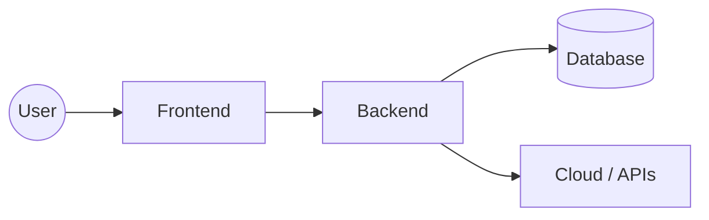
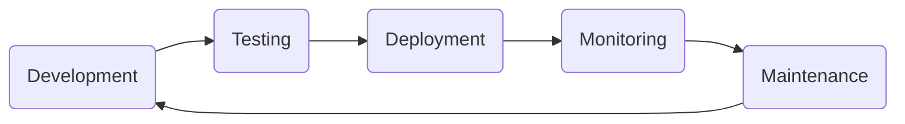

# 💻 Full-Stack Development Roadmap

A comprehensive, interactive, and modern guide for mastering the entire web ecosystem. From the pixel-perfect frontend to the robust cloud infrastructure.

---

## 📖 Table of Contents
1.  [What is Full-Stack Development](#1-what-is-full-stack-development)
2.  [Application Lifecycle](#2-application-lifecycle)
3.  [Common Tech Stacks](#3-common-tech-stacks)
4.  [Types of Full-Stack Developers](#4-types-of-full-stack-developers)
5.  [🏗 The 13 Layers of Full-Stack Architecture](#-the-13-layers-of-full-stack-architecture)
    *   [1. Frontend](#1-frontend)
    *   [2. Backend](#2-backend)
    *   [3. API Design](#3-api-design)
    *   [4. Database Management](#4-database-management)
    *   [5. Servers & OS](#5-servers--os)
    *   [6. Networking Basics](#6-networking-basics)
    *   [7. Cloud Infrastructure](#7-cloud-infrastructure)
    *   [8. CI/CD Pipelines](#8-ci/cd-pipelines)
    *   [9. Cyber Security](#9-cyber-security)
    *   [10. Containers & Orchestration](#10-containers--orchestration)
    *   [11. CDN & Caching](#11-cdn--caching)
    *   [12. Monitoring & Logging](#12-monitoring--logging)
    *   [13. Backups & Recovery](#13-backups--recovery)
6.  [🛠 Full-Stack & QA Tools Section](#-full-stack--qa-tools-section)
7.  [🧠 Mastery Checklist](#-mastery-checklist)
8.  [⚠️ Important Reality](#-important-reality)

---

## 1️⃣ What is Full-Stack Development

Full-Stack development is the art of building both the frontend (the part users see) and backend (the server-side logic and database) of a web application. A full-stack developer is a versatile engineer who can navigate through every layer of a project, from designing a pixel-perfect UI to optimizing database queries.

### 🌐 All Layers Explained
*   **Frontend**: The visual part of the web that users interact with directly.
*   **Backend**: The "brain" behind the application that processes data and manages state.
*   **API**: Application Programming Interface — the contract for how systems talk.
*   **Database**: Structured storage for persistent application data.
*   **Servers**: The physical or virtual environments where your code runs.
*   **Cloud Infrastructure**: Managed hosting and services that provide high availability.
*   **DevOps**: The practices that automate software delivery.
*   **Security**: The layer that protects user data and ensures privacy.

### 🔄 Architecture Flow

> `User → Frontend → Backend → Database → Cloud`

---

## 2️⃣ Application Lifecycle

The journey of an application from a concept to a live, production-ready product.

1.  **Development**: Conceptualizing, designing, and writing the code for features.
2.  **Testing**: Ensuring the code works as expected through unit, integration, and E2E tests.
3.  **Deployment**: Pushing the code to staging and production environments.
4.  **Monitoring**: Tracking performance, errors, and user behavior in real-time.
5.  **Maintenance**: Fixing bugs, updating dependencies, and scaling based on demand.

---

## 3️⃣ Common Tech Stacks

Choose your weapon. A "Stack" is a predefined collection of tools that play well together.

| Stack | Technologies | Use Case |
| :--- | :--- | :--- |
| **MERN** | MongoDB, Express, React, Node.js | Modern, fast, full-JS apps |
| **MEAN** | MongoDB, Express, Angular, Node.js | Enterprise-grade applications |
| **LAMP** | Linux, Apache, MySQL, PHP | Classic, reliable, huge community |
| **Django Stack** | Python, Django, PostgreSQL, React | Rapid development for data-rich apps |
| **.NET Stack** | Azure, C#, SQL Server, Angular/React | Scalable corporate applications |
| **T3 Stack** | Next.js, TypeScript, tRPC, Prisma | Type-safe full-stack performance |

---

## 4️⃣ Types of Full-Stack Developers

*   💻 **Web Full-Stack**: The "standard" developer focused on building browser-based applications. Mastery over the 13 layers mentioned below.
*   📱 **Mobile Full-Stack**: Focuses on mobile apps (React Native, Flutter) while also handling the backend APIs and infrastructure.
*   ☁️ **Cloud-Focused**: A developer who specializes in serverless architectures, microservices, and specialized cloud services like AWS Lambda or GCP.
*   📦 **Product-Oriented**: A developer who prioritizes UX and business value, often bridging the gap between design and engineering.

---

## 🔥 Core Section: Full-Stack Layers

### 🏗 The 13 Layers of Full-Stack Architecture

#### 1. Frontend
*   **What It Is**: The user interface and experience (UI/UX) layer.
*   **Core Technologies**: HTML5, CSS3, JavaScript, TypeScript, React/Vue/Svelte.
*   **Key Skills**: Responsive design, State management, Component architecture.
*   **How to Know You Mastered It**: You can build a complex, responsive layout from a Figma design using modern CSS and state management.

**Checklist:**
- [ ] Build responsive UI
- [ ] Manage global state (Redux/Zustand/Pinia)
- [ ] Connect and consume REST/GraphQL APIs
- [ ] Implement client-side routing

#### 2. Backend
*   **What It Is**: The server-side logic and application core.
*   **Core Technologies**: Node.js, Python (Django/FastAPI), Go, Ruby, Java.
*   **Key Skills**: Auth (JWT/OAuth), Business logic, Data processing.
*   **How to Know You Mastered It**: You can handle CRUD operations and manage server-side business logic securely and efficiently.

**Checklist:**
- [ ] Set up a server with Express/FastAPI
- [ ] Implement secure Authentication & Authorization
- [ ] Handle file uploads and processing
- [ ] Build mid-sized microservices

#### 3. API Design
*   **What It Is**: The contract between frontend and backend.
*   **Core Technologies**: REST, GraphQL, gRPC, tRPC, WebSockets.
*   **Key Skills**: Endpoint structural design, Versioning, Documentation.
*   **How to Know You Mastered It**: You can design a logical, scalable API that is easy for other developers to consume.

**Checklist:**
- [ ] Design RESTful endpoints
- [ ] Write API documentation (Swagger/Postman)
- [ ] Implement WebSockets for real-time updates
- [ ] Handle Rate Limiting and Error codes

#### 4. Database Management
*   **What It Is**: Persistent storage and data relational modeling.
*   **Core Technologies**: PostgreSQL, MySQL, MongoDB, Redis, Prisma/Sequelize.
*   **Key Skills**: Schema design, Indexing, Transactions, Migrations.
*   **How to Know You Mastered It**: You can model complex data relationships and optimize slow-running queries.

**Checklist:**
- [ ] Design relational schemas (Third Normal Form)
- [ ] Implement Database Migrations
- [ ] Use Caching (Redis) for performance
- [ ] Write complex SQL joins and aggregations

#### 5. Servers & OS
*   **What It Is**: The environment where your code executes.
*   **Core Technologies**: Linux (Ubuntu/Debian), Bash, Nginx, Apache, PM2.
*   **Key Skills**: Terminal proficiency, Server configuration, Reverse proxies.
*   **How to Know You Mastered It**: You can SSH into a server, install dependencies, and configure Nginx to serve your app.

**Checklist:**
- [ ] Master basic Linux Terminal commands
- [ ] Configure Nginx as a Reverse Proxy
- [ ] Manage processes with PM2 or Systemd
- [ ] Secure server with SSH Keys and Firewalls

#### 6. Networking Basics
*   **What It Is**: How computer systems communicate over the internet.
*   **Core Technologies**: HTTP/HTTPS, DNS, SSL/TLS, TCP/IP, CORS.
*   **Key Skills**: Debugging network requests, Managing certificates.
*   **How to Know You Mastered It**: You understand the full lifecycle of a URL request from browser to server and back.

**Checklist:**
- [ ] Understand DNS A/CNAME records
- [ ] Set up SSL Certificates (Let's Encrypt)
- [ ] Fix CORS (Cross-Origin Resource Sharing) errors
- [ ] Analyze network traffic with Chrome DevTools

#### 7. Cloud Infrastructure
*   **What It Is**: Scaling and managing resources in the cloud.
*   **Core Technologies**: AWS, Azure, Google Cloud (GCP), DigitalOcean, Vercel.
*   **Key Skills**: Managed services, Auto-scaling, Serverless functions.
*   **How to Know You Mastered It**: You can deploy a multi-service application that scales based on traffic.

**Checklist:**
- [ ] Deploy a static site to Vercel/Netlify
- [ ] Use AWS S3 for object storage
- [ ] Set up an AWS EC2 or DigitalOcean Droplet
- [ ] Implement Serverless functions (Lambda)

#### 8. CI/CD Pipelines
*   **What It Is**: Automated testing and deployment workflows.
*   **Core Technologies**: GitHub Actions, GitLab CI, Jenkins, CircleCI.
*   **Key Skills**: Pipeline scripting, Automated testing, Build optimization.
*   **How to Know You Mastered It**: Every git push automatically runs tests and deploys the app if they pass.

**Checklist:**
- [ ] Build a GitHub Action for linting/testing
- [ ] Automate deployments to Production
- [ ] Manage Environment Secrets securely
- [ ] Implement Blue/Green or Canary deployments

#### 9. Cyber Security
*   **What It Is**: Protecting the app from malicious attacks.
*   **Core Technologies**: OWASP Top 10, JWT, Hashing (Bcrypt), HTTPS.
*   **Key Skills**: Identifying vulnerabilities, sanitizing inputs.
*   **How to Know You Mastered It**: Your application is resilient against SQL injection, XSS, and CSRF.

**Checklist:**
- [ ] Implement password hashing with salt
- [ ] Escaping and sanitizing user input
- [ ] Understanding and fixing OWASP vulnerabilities
- [ ] Managing role-based access control (RBAC)

#### 10. Containers & Orchestration
*   **What It Is**: Standardizing environments for consistency.
*   **Core Technologies**: Docker, Kubernetes (K8s), Docker Compose.
*   **Key Skills**: Writing Dockerfiles, Managing container communication.
*   **How to Know You Mastered It**: "It works on my machine" is no longer an issue because the environment is containerized.

**Checklist:**
- [ ] Write a Dockerfile for a Node/Python app
- [ ] Use Docker Compose for multi-container apps
- [ ] Understand Kubernetes Pods and Services
- [ ] Push images to Container Registries (DockerHub)

#### 11. CDN & Caching
*   **What It Is**: Improving performance by serving content from the edge.
*   **Core Technologies**: Cloudflare, Akamai, AWS CloudFront.
*   **Key Skills**: Static asset optimization, Cache invalidation.
*   **How to Know You Mastered It**: Your global users experience low latency regardless of their distance from the server.

**Checklist:**
- [ ] Configure a CDN for static assets
- [ ] Set up Cache-Control headers
- [ ] Optimize images for web delivery
- [ ] Implement edge caching rules

#### 12. Monitoring & Logging
*   **What It Is**: Keeping an eye on production health and errors.
*   **Core Technologies**: Sentry, Datadog, ELK Stack, Loggly, Grafana.
*   **Key Skills**: Error tracking, System performance monitoring.
*   **How to Know You Mastered It**: You are alerted of errors before your users report them.

**Checklist:**
- [ ] Integrate Sentry for error tracking
- [ ] Set up structured logging (Winston/Pino)
- [ ] Monitor CPU/Memory usage metrics
- [ ] Create automated Uptime alerts

#### 13. Backups & Recovery
*   **What It Is**: Disaster recovery for data and systems.
*   **Core Technologies**: AWS RDS Snapshots, Cron jobs, Offsite storage.
*   **Key Skills**: Recovery strategies, Backup automation.
*   **How to Know You Mastered It**: You can recover from a total database failure in minutes with zero data loss.

**Checklist:**
- [ ] Automate Database Snapshots
- [ ] Test a recovery procedure from scratch
- [ ] Set up off-site backup storage
- [ ] Implement Point-in-time recovery

---

## 🛠 Full-Stack & QA Tools Section

### 🎨 Frontend Frameworks
*   **React**: The industry favorite for component-based UI.
*   **Vue.js**: Versatile and progressive.
*   **Angular**: Enterprise-grade framework.
*   **Svelte**: Pre-compiled, ultra-high performance.
*   **Next.js**: The go-to for SSR/SSG React apps.
*   **Tailwind CSS**: Utility-first styling powerhouse.

### ⚙️ Backend & Runtimes
*   **Node.js**: Asynchronous, event-driven JS runtime.
*   **Bun / Deno**: Next-gen fast JS runtimes.
*   **Express**: Minimalist web framework for Node.
*   **FastAPI**: High-performance Python framework.
*   **Go (Golang)**: Built for concurrency and speed.

### 🧪 Testing & QA Tools
*   **Jest**: The gold standard for JS Unit testing.
*   **Cypress**: All-in-one E2E testing with a great GUI.
*   **Playwright**: Modern cross-browser automation by Microsoft.
*   **Selenium**: The veteran of browser automation.
*   **K6**: Modern load testing for APIs.

### ☁️ Cloud & Platform
*   **AWS / GCP / Azure**: The big three cloud providers.
*   **Vercel / Netlify**: Best-in-class frontend deployment.
*   **Railway / Render**: Simple, powerful backend hosting.
*   **Supabase / Firebase**: Backend-as-a-Service (BaaS).

### 🧰 Developer Productivity
*   **VS Code**: The essential code editor.
*   **Cursor**: AI-first IDE fork of VS Code.
*   **Git / GitHub**: Version control and collaboration.
*   **Docker**: Containerization and environment isolation.
*   **Postman / Insomnia**: API development and testing.

---

## 🧠 Mastery Checklist

How do you know you are a "Senior Full-Stack Developer"? Use this list as your north star.

- [ ] **Build from Scratch**: Can you take a blank folder and deploy a live app?
- [ ] **Deploy Independently**: Can you set up the infrastructure without a DevOps team?
- [ ] **Cross-Layer Debugging**: Can you find a bug that starts in the DB and ends in the UI?
- [ ] **Authentication**: Do you deeply understand JWT, Cookies, and OAuth flows?
- [ ] **Architecture**: Can you design a system that scales to 100k users?
- [ ] **Database Design**: Can you normalize data and write efficient indexes?
- [ ] **Security First**: Is "Security" a step in your development, not an afterthought?
- [ ] **Testing Culture**: Do you write tests before or while writing code?

---

## ⚠️ Important Reality

> [!IMPORTANT]
> **Full-Stack does not mean expert in everything.**
> It means being comfortable across the entire stack, understanding how the pieces fit together, and, most importantly, being capable of **shipping real products independently**.
>
> Your job isn't to memorize libraries; it's to **solve problems** using the most efficient tools available.

---

*Designed for ambitious developers. © 2026 FullStack Master Roadmap.*
# Full-Stack-Roadmap

